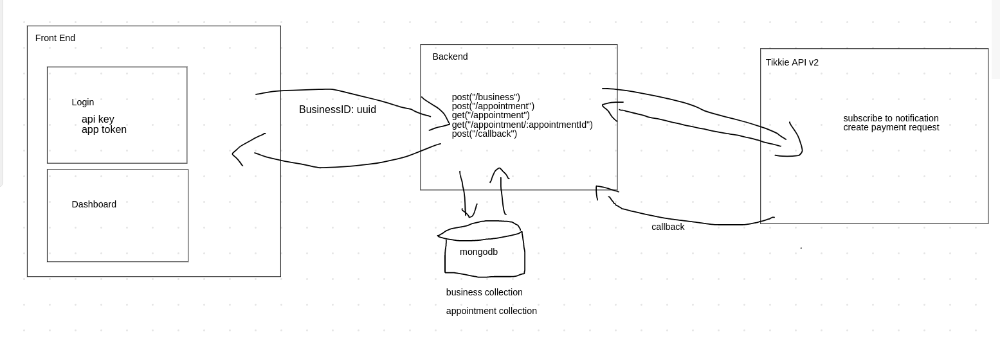
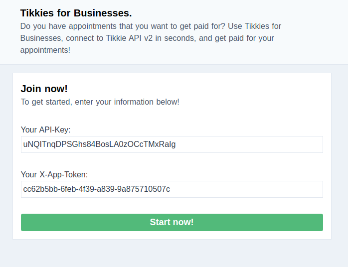
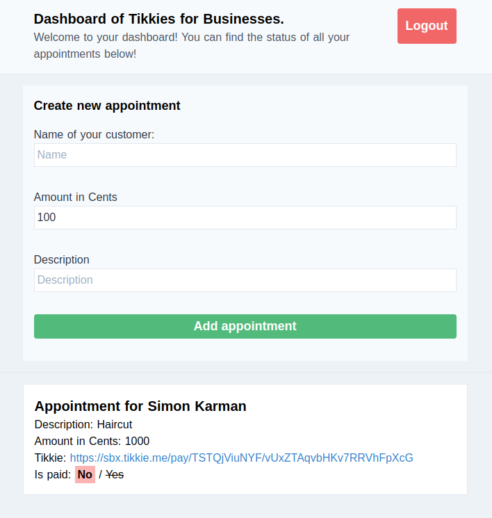

Tikkie for Businesses
===

This is a test project that was build during my time at Tikkie. 

Tikkie is a Dutch mobile app that lets individuals pay small amounts of money to family and friends. Tikkie is part of ABN AMRO, is used in The Netherlands, and uses the Dutch iDeal payment system to facilitates that payments.

Most Dutch people know Tikkie, its even part of the Dutch dictionary. At the time of writing (may 2020), Tikkie has 6 million active users. Since the brand is well known and is asocciated with a positive and young vibe, it can also be interesting for companies to use Tikkie for their business payments. Businesses that have been onboarded at ABN AMRO can use Tikkie for business-to-customer and business-to-business payments. To facilitate this an API was build. Together with the rest of my team at ABN AMRO we build version 2 of the Tikkie API.

Tikkie for Businesses is the result of a team-building activity we did. The goal was to step into the mind of a developer using the Tikkie API and to find out what the developer experience of our API is. We took one full day to build a simple application, this repository is what I made during that day. Tikkie for Businesses gives businesses an overview of their appointments including an easy payment method using Tikkie.

Note that this application merely exists to functions as an example application to shows off how easy it is to integrate Tikkie API v2 in your own project.

## Resources
The following resources can be interseting to read before continuing with this application.

- [Tikkie Website](https://www.tikkie.me/bedrijven)
- [ABN Developer Portal](https://developer.abnamro.com/)
- [Tikkie API Documentation](https://developer.abnamro.com/api-products/tikkie/reference-documentation)
- [Tikkie for Businesses](https://www.simonkarman.nl/projects/tikkie-for-businesses) on simonkarman.nl

## Tikkie for Businesses
Tikkie for Businesses is the name of this project. The aim of the project is to give a business an easy way for tracking its appointments and their payments. It provides a single dashboard that shows its business-to-consumer Tikkies and keeps track of which of these payment requests have been paid.

As a (sandbox) business you can use Tikkie for Businesses by entering the API-Key you got from the developer portal, and the App Token that you received from the [Sandbox environment of the Tikkie API](https://developer.abnamro.com/api-products/tikkie/reference-documentation#section/Sandbox-access)

```bash
# request your sandbox app token using your api key
$ curl --data "{}" -H "API-Key: <YOUR-API-KEY-HERE>" https://api-sandbox.abnamro.com/v2/tikkie/sandboxapps
```

**Important!** *Please note that this application is NOT safe to use and should therefore NOT be used in the production environment.*

## Architecture
The architecture of this application can be seen in the image below. The application consists of the following components:
- **A database**: MongoDB No-SQL database (https://www.mongodb.com/)
- **A server**: NodeJS back end using Express (https://expressjs.com/)
- **A client**: Vue front end using Vuex and TailwindCSS (https://vuejs.org/)
- **The Tikkie API!**: We use Tikkie API v2 on the `Sandbox` environment (https://developer.abnamro.com/api-products/tikkie/reference-documentation)



## Database (MongoDB)
The database used by the back end is MongoDB. MongoDB is a document-based database. Please ensure you have MongoDB up and running before starting the backend.

The server application creates the `tikkie-api-v2-implementation-day` database in mongodb.

A guide to install the community edition of MongoDB can be found here:
[MongoDB Install Community Edition](https://docs.mongodb.com/manual/administration/install-community/)

To verify your installation succeeded
```bash
# ensure you have mongod running locally
$ sudo systemctl mongod status

# if mongodb doesn't start, ensure owner is set to mongodb:mongodb for the following files
$ sudo chown -R mongodb:mongodb /var/lib/mongodb
$ sudo chown mongodb:mongodb /tmp/mongodb-27017.sock

# The following can be used to delete ALL your local databases in MongoDB. Please use with caution.
$ mongo
> var db = db.getMongo().getDB('tikkie-api-v2-implementation-day'); db.dropDatabase();
```

By default MongoDB only accepts connection to the database from the localhost. If you're running the server on a different host than the database ensure that the server is allowed to access the MongoDB databases!

## Server (back end)
The back end of this application is build using Express. Express is a minimalist web framework for NodeJS. The back end can be found in the `./server` directory at the root of this repository.

To start the server:
```bash
# change to the server directory
$ cd server

# install dependencies
$ npm install

# (optional) point to your development server so that tikkie api v2 can reach it for callbacks
# Do NOT include a trailing slash!
$ export BASE_URL='http://tikkie-businesses.simonkarman.nl:17233'

# start up the development server
$ npm run dev

# the server should now be running on localhost:17233
```

The server application creates the `tikkie-api-v2-implementation-day` database in the MongoDB database. Within this databases it creates and uses the `business` and `appointment` collections.

The server has the following 5 endpoints:
- **POST /business** - This endpoint creates a business based on the given API Key and App Token. It first subscribes the callback endpoint of the server as the notification handler at the Tikkie API. This ensures the API Key and App Token are valid. This results in a subscription id. This subscription id is added to the business. If a business with the given api key and app token already exists, that is used. Otherwise it is created in the business collection in MongoDB. The business is then returned to the caller.
- **POST /appointment** - This endpoint creates an appointment for a business given the businessId, customerName, amountInCents, and description. It first fetches the app token and api key from the business collection based on the business id. Using these credentials it then creates a payment request at the Tikkie API. The resulting payment request information is saved together with the appointment information in the appointment collection in MongoDB. The appointment is then returned to the caller.
- **POST /callback** - This endpoint is used by the Tikkie API to notify that payment requests have been paid. Based on the content of the callback the correct appointment is determined and it is then marked as paid by setting the isPaid property to true.
- **GET /appointment** - This endpoint is used to retrieve a list of all appointments of a business. The business is determined by the `X-Business-Id` header in the GET request. The response is a list of appointment ids.
- **GET /appointment/:appointmentId** - This endpoint is used to retrieve all details of a specific appointment of a business. The appointmentId is part of the path and the business is determined by the `X-Business-Id` header in the GET request. The response is a detailed object containing all information of the appointment.

## Client (front end)
The client is a Vue front end. It uses Vuex as its store and TailwindCSS as CSS framework. The front end can be found in the `./viewer` directory at the root of this repository.

The front end uses the 5 endpoints provided by the server to communicate with the Tikkie API.

To start the client:
```bash
# change to the client directory
$ cd client

# copy the app-secrets.json.defaults and fill in the details
$ cp app-secrets.json.default app-secrets.json
$ vi app-secrets.json # set your api key and app token (or leave as is)

# install all dependencies
$ npm install

# (optional) point to your development server so that your front end can reach your back end from any device
# Do NOT include a trailing slash!
$ export BASE_URL='http://tikkie-businesses.simonkarman.nl:17233'

# start up the development server
$ npm run dev

# the client should now be running on localhost:17232
# open http://localhost:17232/dashboard in your favorite browser
```

The login page of the front end


The dashboard of the front end
